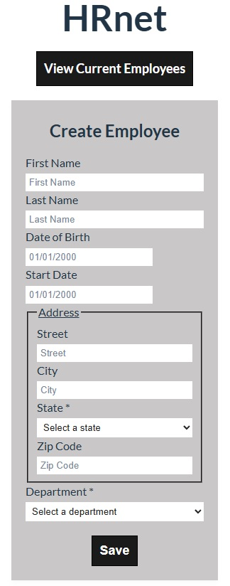

# HRNet - Employee Management App

HRNet est une application React permettant de gérer les employés d'une entreprise. Elle permet de créer des profils d'employés, de stocker les données dans le `localStorage`, et d'utiliser des composants réutilisables comme un Dropdown personnalisé pour les états et départements.

---

## Capture d'écran



---

## Installation

Clone le dépôt et installe les dépendances :

git clone https://github.com/Nico-Coni/HRNet
cd HRNet
npm install


## Fonctionnalités

Ajouter un employé avec des informations complètes (nom, prénom, date de naissance, adresse, département, etc.)

Modifier les informations des employés

Stockage des données dans le localStorage

Dropdown personnalisé pour sélectionner les états et départements

## Technologies utilisées 

React 19

React Router

Vite

ESLint

CSS pour le style

## Structure du projet 

/src
  /components
    Field.jsx
    Dropdown.jsx
    Modal.jsx
  /containers
    Form.jsx
  /hooks
    useLocalStorageState.js
  /data
    data.js
  /utils
    fieldTypes.js

## Plugins utilisées 

react-datepicker : https://www.npmjs.com/package/react-datepicker

react-modal : https://www.npmjs.com/package/react-modal

primereact DataTable : https://www.npmjs.com/package/primereact/

plugin_dropdown_for_hrnet : https://www.npmjs.com/package/plugin_dropdown_for_hrnet

Pour l'utilisation du plugin Dropdown, voici un exemple d'utilisation dans un formulaire : 
```jsx
import Dropdown from "plugin_dropdown_for_hrnet";

<Dropdown
  label="Department"
  name="department"
  id="department"
  placeholder="Select a department"
  required
  options={departments}
  onChange={handleChangeForm}
  value={formData.department}
/>
```

Ici on va avoir des états qui vont comporter un name et une abbreviation alors : 
```jsx
<Dropdown
  label="State"
  name="state"
  id="state"
  placeholder="Select a state"
  required
  options={states.map(state => state.name)}
  onChange={handleChangeForm}
  value={formData.state}
/>
```
## Performance

Un audit Lighthouse a été effecué.

- **Performance** : 100/100
- **Accessibilité** : 100/100
- **Best Practices** : 100/100
- **SEO**: 100/100

Les rapports complets sont disponible dans le dossier (./doc)

## Contibuer

1. Fork le dépôt
2. Créer une branche (git chackout -b feature/ma-fonctionnalité)
3. Commit et push (git commit -m "Ma nouvelle fonctionnalité")
4. Ouvre une pull request

##  Licence

MIT